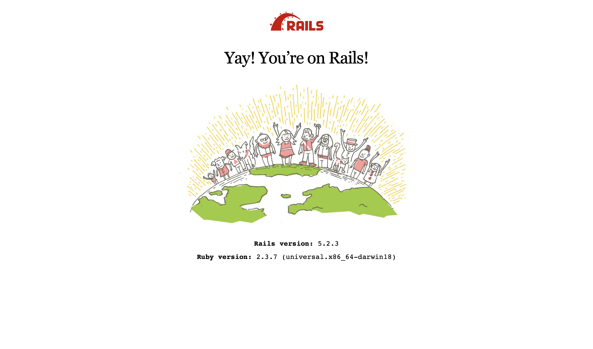

# 멋쟁이 사자처럼🦁 6기(2018) 내용 복습

## 해당 내용은 [유니라이언](https://uni.likelion.org) 내용을 복습한 내용📝들 입니다.
---
* <h2>개발 환경</h2>
    - 💻mac os Mojave(10.14.5) 
    - 📝Code Editor : VS Code

    |Ruby version | Rails version |
    |:--------:|:--------:|
    | 2.3.7 | 5.2.3|

    
---
* ## 강좌 목록 및 소스 내용
---
* ## [first_app](https://github.com/devsungmin/Ruby-Project/tree/master/first_app) / [ruby_files](https://github.com/devsungmin/Ruby-Project/tree/master/ruby_files)
|제목 | 링크 |
|:--------:|:--------:|
|Rails First APP_1 | [바로가기](https://uni.likelion.org/lectures/10) |
|Rails First APP_2 | [바로가기](https://uni.likelion.org/lectures/11) |
|Rails First APP_3 | [바로가기](https://uni.likelion.org/lectures/12) |
|Rails First APP_4 | [바로가기](https://uni.likelion.org/lectures/13) |
|Ruby 주식정보 가져오기 | [바로가기](https://uni.likelion.org/lectures/14) |
|Rails First APP_5 | [바로가기](https://uni.likelion.org/lectures/16) |
---
* ## [second_app](https://github.com/devsungmin/Ruby-Project/tree/master/second_app)
|제목 | 링크 |
|:--------:|:--------:|
|Rails Model | [바로가기](https://uni.likelion.org/lectures/17) |
|CRUD_실습 | [바로가기](https://uni.likelion.org/lectures/18) |
|Rails_Create | [바로가기](https://uni.likelion.org/lectures/19) |
|Rails_Read | [바로가기](https://uni.likelion.org/lectures/20) |
|Rails_Destroy | [바로가기](https://uni.likelion.org/lectures/21) |
|Rails_Update| [바로가기](https://uni.likelion.org/lectures/22) |
|Rails_RESTful_routing | [바로가기](https://uni.likelion.org/lectures/23) |
|Model_Association | [바로가기](https://uni.likelion.org/lectures/24) |
|Model_Association_실습 | [바로가기](https://uni.likelion.org/lectures/25) |
|Comment_Model| [바로가기](https://uni.likelion.org/lectures/26) |
|Comment_CRD | [바로가기](https://uni.likelion.org/lectures/27) |
---
* ## [scaffold_app](https://github.com/devsungmin/Ruby-Project/tree/master/scaffold_app)
|제목 | 링크 |
|:--------:|:--------:|
|Scaffold_intro | [바로가기](https://uni.likelion.org/lectures/28) |
|Scaffold_1 | [바로가기](https://uni.likelion.org/lectures/29) |
|Scaffold_2 | [바로가기](https://uni.likelion.org/lectures/30) |